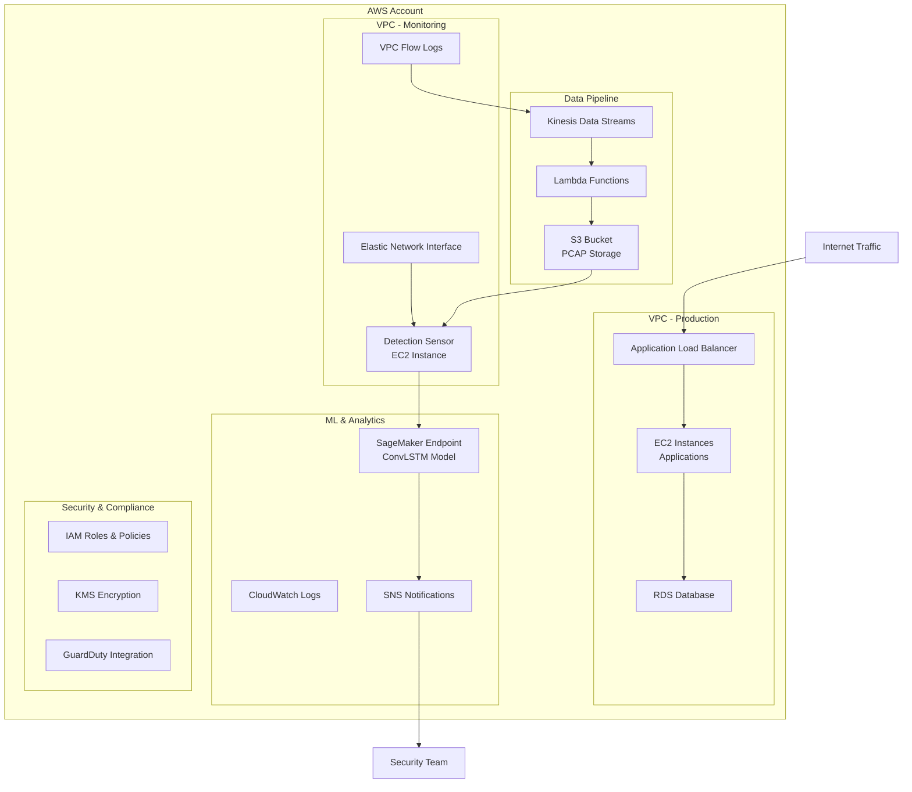

# AWS Ransomware Detection Architecture

## Visión General

Este documento describe la arquitectura para implementar un sistema de detección de ransomware en tiempo real en AWS, utilizando el modelo ConvLSTM entrenado para analizar tráfico de red y detectar patrones maliciosos.

## Arquitectura de Alto Nivel



## Componentes Principales

### 1. Captura de Tráfico de Red

#### VPC Flow Logs

- **Propósito**: Capturar metadatos de tráfico de red
- **Configuración**: Habilitar en todas las VPCs críticas
- **Destino**: Amazon Kinesis Data Streams

```json
{
  "version": 2,
  "account-id": "123456789012",
  "interface-id": "eni-12345678",
  "srcaddr": "10.0.1.12",
  "dstaddr": "10.0.0.220",
  "srcport": 39804,
  "dstport": 80,
  "protocol": 6,
  "packets": 1,
  "bytes": 40,
  "windowstart": 1439533020,
  "windowend": 1439533080,
  "action": "ACCEPT"
}
```

#### Packet Mirroring (VPC Traffic Mirroring)

- **Propósito**: Capturar paquetes completos para análisis profundo
- **Configuración**: Mirroring de tráfico crítico a instancia de análisis
- **Filtros**: TCP/UDP, puertos específicos, subnets críticas

### 2. Procesamiento de Datos

#### Amazon Kinesis Data Streams

- **Shards**: 2-4 shards para alta disponibilidad
- **Retención**: 24 horas (máximo)
- **Compresión**: GZIP para optimizar costos

#### AWS Lambda Functions

- **Función de Preprocesamiento**:
  - Convierte VPC Flow Logs a formato estándar
  - Filtra tráfico irrelevante
  - Agrupa paquetes por ventanas temporales

```python
import json
import boto3
import base64
from datetime import datetime

def lambda_handler(event, context):
    # Procesar registros de VPC Flow Logs
    for record in event['Records']:
        # Decodificar datos de Kinesis
        payload = base64.b64decode(record['kinesis']['data'])
        flow_log = json.loads(payload)

        # Filtrar tráfico relevante
        if is_relevant_traffic(flow_log):
            # Agrupar en ventanas de 10 paquetes
            process_traffic_window(flow_log)

    return {'statusCode': 200}
```

### 3. Modelo de Machine Learning

#### Amazon SageMaker Endpoint

- **Instancia**: ml.m5.xlarge (4 vCPU, 16 GB RAM)
- **Modelo**: ConvLSTM para detección de ransomware
- **Escalado**: Auto-scaling basado en latencia
- **Endpoint**: HTTPS REST API

```python
import boto3
import numpy as np

class RansomwareDetector:
    def __init__(self):
        self.sagemaker = boto3.client('sagemaker-runtime')
        self.endpoint_name = 'ransomware-detection-endpoint'

    def detect_ransomware(self, packet_sequence):
        # Preprocesar secuencia de paquetes
        processed_data = self.preprocess_packets(packet_sequence)

        # Invocar endpoint de SageMaker
        response = self.sagemaker.invoke_endpoint(
            EndpointName=self.endpoint_name,
            ContentType='application/json',
            Body=json.dumps(processed_data.tolist())
        )

        # Procesar respuesta
        prediction = json.loads(response['Body'].read())
        return prediction
```

### 4. Sensor de Detección

#### EC2 Instance (Detection Sensor)

- **Tipo**: t3.medium (2 vCPU, 4 GB RAM)
- **AMI**: Amazon Linux 2 con Docker
- **Almacenamiento**: 30 GB EBS GP3
- **Red**: Subnet dedicada para monitoreo

#### Configuración del Sensor

```yaml
# configs/aws-sensor.yaml
model:
  endpoint: "https://runtime.sagemaker.us-east-1.amazonaws.com/endpoints/ransomware-detection-endpoint"
  input_shape: [10, 32, 32, 1]

detection:
  threshold: 0.80
  window_size: 10
  packet_size: 1024

capture:
  mode: "aws"
  vpc_flow_logs: true
  traffic_mirroring: true
  kinesis_stream: "vpc-flow-logs-stream"

alerts:
  sns:
    enabled: true
    topic_arn: "arn:aws:sns:us-east-1:123456789012:ransomware-alerts"
    region: "us-east-1"
  cloudwatch:
    enabled: true
    log_group: "/aws/ransomware-detection"
```

### 5. Almacenamiento y Análisis

#### Amazon S3

- **Bucket**: `company-ransomware-detection-data`
- **Estructura**:
  ```
  s3://company-ransomware-detection-data/
  ├── raw-traffic/
  │   ├── year=2024/month=01/day=15/
  │   └── year=2024/month=01/day=16/
  ├── processed-traffic/
  │   ├── benign/
  │   └── malicious/
  └── model-artifacts/
      ├── convlstm_model.keras
      └── preprocessing_config.json
  ```

#### Amazon CloudWatch

- **Métricas personalizadas**:
  - `RansomwareDetection/DetectionsPerMinute`
  - `RansomwareDetection/FalsePositiveRate`
  - `RansomwareDetection/ModelLatency`

### 6. Notificaciones y Alertas

#### Amazon SNS

- **Topics**:
  - `ransomware-alerts` (Crítico)
  - `security-notifications` (Información)
- **Suscriptores**: Email, SMS, Slack, PagerDuty

#### Amazon EventBridge

- **Reglas**: Eventos personalizados para integración
- **Targets**: Lambda, SNS, Step Functions

## Implementación Paso a Paso

### Fase 1: Preparación de la Infraestructura

#### 1.1 Configurar VPC Flow Logs

```bash
# Habilitar VPC Flow Logs
aws logs create-log-group --log-group-name /aws/vpc/flowlogs
aws ec2 create-flow-logs \
  --resource-type VPC \
  --resource-ids vpc-12345678 \
  --traffic-type ALL \
  --log-destination-type cloud-watch-logs \
  --log-group-name /aws/vpc/flowlogs
```

#### 1.2 Crear Kinesis Data Stream

```bash
aws kinesis create-stream \
  --stream-name vpc-flow-logs-stream \
  --shard-count 2
```

#### 1.3 Configurar IAM Roles

```json
{
  "Version": "2012-10-17",
  "Statement": [
    {
      "Effect": "Allow",
      "Action": [
        "kinesis:GetRecords",
        "kinesis:GetShardIterator",
        "kinesis:DescribeStream"
      ],
      "Resource": "arn:aws:kinesis:us-east-1:123456789012:stream/vpc-flow-logs-stream"
    },
    {
      "Effect": "Allow",
      "Action": ["sagemaker:InvokeEndpoint"],
      "Resource": "arn:aws:sagemaker:us-east-1:123456789012:endpoint/ransomware-detection-endpoint"
    }
  ]
}
```

### Fase 2: Despliegue del Modelo

#### 2.1 Crear Modelo en SageMaker

```python
import boto3
import sagemaker
from sagemaker.tensorflow import TensorFlowModel

# Configurar SageMaker
sagemaker_session = sagemaker.Session()
role = 'arn:aws:iam::123456789012:role/SageMakerExecutionRole'

# Crear modelo
model = TensorFlowModel(
    model_data='s3://company-ransomware-detection-data/model-artifacts/convlstm_model.tar.gz',
    role=role,
    framework_version='2.15.0',
    py_version='py311'
)

# Desplegar endpoint
predictor = model.deploy(
    initial_instance_count=1,
    instance_type='ml.m5.xlarge',
    endpoint_name='ransomware-detection-endpoint'
)
```

#### 2.2 Configurar Auto-scaling

```python
# Configurar auto-scaling
autoscaling_client = boto3.client('application-autoscaling')

autoscaling_client.register_scalable_target(
    ServiceNamespace='sagemaker',
    ResourceId='endpoint/ransomware-detection-endpoint/variant/AllTraffic',
    ScalableDimension='sagemaker:variant:DesiredInstanceCount',
    MinCapacity=1,
    MaxCapacity=4
)

autoscaling_client.put_scaling_policy(
    ServiceNamespace='sagemaker',
    ResourceId='endpoint/ransomware-detection-endpoint/variant/AllTraffic',
    ScalableDimension='sagemaker:variant:DesiredInstanceCount',
    PolicyName='RansomwareDetectionScalingPolicy',
    PolicyType='TargetTrackingScaling',
    TargetTrackingScalingPolicyConfiguration={
        'TargetValue': 70.0,
        'PredefinedMetricSpecification': {
            'PredefinedMetricType': 'SageMakerVariantInvocationsPerInstance'
        }
    }
)
```

### Fase 3: Despliegue del Sensor

#### 3.1 Crear AMI Personalizada

```dockerfile
# Dockerfile para el sensor
FROM amazonlinux:2

# Instalar dependencias
RUN yum update -y && \
    yum install -y python3 python3-pip git

# Instalar Python packages
COPY requirements.txt .
RUN pip3 install -r requirements.txt

# Copiar código del sensor
COPY app/sensor/ /opt/sensor/
WORKDIR /opt/sensor

# Configurar usuario no-root
RUN useradd -r -s /bin/false sensor
USER sensor

# Comando de inicio
CMD ["python3", "src/main.py", "--mode", "aws"]
```

#### 3.2 Launch Template

```json
{
  "LaunchTemplateName": "ransomware-sensor-template",
  "LaunchTemplateData": {
    "ImageId": "ami-12345678",
    "InstanceType": "t3.medium",
    "KeyName": "ransomware-detection-key",
    "SecurityGroupIds": ["sg-12345678"],
    "SubnetId": "subnet-12345678",
    "IamInstanceProfile": {
      "Name": "RansomwareDetectionInstanceProfile"
    },
    "UserData": "IyEvYmluL2Jhc2gKc3VkbyB5dW0gdXBkYXRlIC15CnN1ZG8geXVtIGluc3RhbGwgLXkgZG9ja2VyCnN1ZG8gc3lzdGVtY3RsIHN0YXJ0IGRvY2tlcgpzdWRvIHN5c3RlbWN0bCBlbmFibGUgZG9ja2VyCg=="
  }
}
```

### Fase 4: Monitoreo y Alertas

#### 4.1 CloudWatch Dashboard

```json
{
  "widgets": [
    {
      "type": "metric",
      "properties": {
        "metrics": [
          [
            "AWS/SageMaker",
            "ModelLatency",
            "EndpointName",
            "ransomware-detection-endpoint"
          ],
          ["Custom/RansomwareDetection", "DetectionsPerMinute"],
          ["Custom/RansomwareDetection", "FalsePositiveRate"]
        ],
        "period": 300,
        "stat": "Average",
        "region": "us-east-1",
        "title": "Ransomware Detection Metrics"
      }
    }
  ]
}
```

#### 4.2 Configurar Alertas

```bash
# Crear alarma para detecciones altas
aws cloudwatch put-metric-alarm \
  --alarm-name "HighRansomwareDetectionRate" \
  --alarm-description "Alert when ransomware detection rate is high" \
  --metric-name DetectionsPerMinute \
  --namespace Custom/RansomwareDetection \
  --statistic Average \
  --period 300 \
  --threshold 10 \
  --comparison-operator GreaterThanThreshold \
  --alarm-actions arn:aws:sns:us-east-1:123456789012:ransomware-alerts
```

## Consideraciones de Seguridad

### 1. Encriptación

- **En tránsito**: TLS 1.2+ para todas las comunicaciones
- **En reposo**: KMS para S3, EBS, y SageMaker
- **Claves**: Rotación automática cada 90 días

### 2. Acceso y Permisos

- **Principio de menor privilegio**: IAM roles específicos
- **MFA**: Requerido para acceso administrativo
- **Auditoría**: CloudTrail habilitado para todas las acciones

### 3. Red

- **VPC**: Subnets privadas para componentes sensibles
- **NACLs**: Restricciones de tráfico estrictas
- **Security Groups**: Reglas mínimas necesarias

### 4. Cumplimiento

- **GDPR**: Anonimización de datos personales
- **SOC 2**: Controles de seguridad implementados
- **ISO 27001**: Gestión de riesgos de seguridad

## Costos Estimados (Mensual)

| Componente                        | Costo Estimado |
| --------------------------------- | -------------- |
| SageMaker Endpoint (ml.m5.xlarge) | $200-400       |
| EC2 Sensor (t3.medium)            | $30-60         |
| Kinesis Data Streams              | $20-50         |
| S3 Storage (100GB)                | $2-5           |
| CloudWatch Logs                   | $10-30         |
| SNS Notifications                 | $1-5           |
| **Total**                         | **$263-550**   |

## Escalabilidad y Rendimiento

### Métricas de Rendimiento

- **Latencia**: < 100ms por inferencia
- **Throughput**: 1000+ paquetes/segundo
- **Disponibilidad**: 99.9% SLA
- **Escalado**: Automático basado en demanda

### Estrategias de Optimización

- **Caching**: Redis para resultados frecuentes
- **Batch Processing**: Agrupación de inferencias
- **Load Balancing**: Distribución de carga
- **CDN**: CloudFront para contenido estático

## Mantenimiento y Operaciones

### Monitoreo Continuo

- **Health Checks**: Verificación de endpoints
- **Log Analysis**: Análisis de patrones anómalos
- **Performance Tuning**: Optimización basada en métricas

### Actualizaciones del Modelo

- **A/B Testing**: Comparación de versiones
- **Blue/Green Deployment**: Despliegue sin interrupciones
- **Rollback**: Reversión rápida en caso de problemas

### Backup y Recuperación

- **S3 Cross-Region Replication**: Backup automático
- **Point-in-Time Recovery**: RDS con backup continuo
- **Disaster Recovery**: Plan de recuperación documentado

## Flujo de Datos Detallado

### 1. Captura de Tráfico

```
Internet Traffic → VPC → VPC Flow Logs → Kinesis Data Streams
                ↓
            Traffic Mirroring → Detection Sensor EC2
```

### 2. Procesamiento de Datos

```
Kinesis Stream → Lambda Function → Data Preprocessing → S3 Storage
     ↓
Detection Sensor → Packet Processing → 32x32 Images → Batch (10 packets)
```

### 3. Inferencia ML

```
Packet Batch → SageMaker Endpoint → ConvLSTM Model → Prediction Score
     ↓
Score > Threshold → SNS Alert → Security Team Notification
```

### 4. Almacenamiento y Análisis

```
Raw Data → S3 (Raw) → Lambda Processing → S3 (Processed) → Athena Query
     ↓
CloudWatch Metrics → Dashboard → Monitoring & Alerting
```

## Integración con AWS GuardDuty

### Configuración de Integración

```python
import boto3

def integrate_with_guardduty():
    guardduty = boto3.client('guardduty')

    # Crear detector de GuardDuty
    detector = guardduty.create_detector(
        Enable=True,
        FindingPublishingFrequency='FIFTEEN_MINUTES'
    )

    # Configurar fuentes de datos
    guardduty.update_detector(
        DetectorId=detector['DetectorId'],
        Enable=True,
        DataSources={
            'S3Logs': {
                'Enable': True
            },
            'DNSLogs': {
                'Enable': True
            },
            'FlowLogs': {
                'Enable': True
            }
        }
    )
```

### Correlación de Eventos

```python
def correlate_ransomware_events():
    # Combinar detecciones de ransomware con hallazgos de GuardDuty
    ransomware_detections = get_ransomware_detections()
    guardduty_findings = get_guardduty_findings()

    for detection in ransomware_detections:
        related_findings = find_related_guardduty_events(
            detection, guardduty_findings
        )

        if related_findings:
            create_security_incident(detection, related_findings)
```

## Automatización con AWS Step Functions

### Workflow de Respuesta Automática

```json
{
  "Comment": "Ransomware Detection Response Workflow",
  "StartAt": "DetectRansomware",
  "States": {
    "DetectRansomware": {
      "Type": "Task",
      "Resource": "arn:aws:lambda:us-east-1:123456789012:function:detect-ransomware",
      "Next": "EvaluateThreat",
      "Catch": [
        {
          "ErrorEquals": ["States.ALL"],
          "Next": "LogError"
        }
      ]
    },
    "EvaluateThreat": {
      "Type": "Choice",
      "Choices": [
        {
          "Variable": "$.threat_score",
          "NumericGreaterThan": 0.8,
          "Next": "HighThreatResponse"
        }
      ],
      "Default": "LowThreatResponse"
    },
    "HighThreatResponse": {
      "Type": "Parallel",
      "Branches": [
        {
          "StartAt": "IsolateAffectedResources",
          "States": {
            "IsolateAffectedResources": {
              "Type": "Task",
              "Resource": "arn:aws:lambda:us-east-1:123456789012:function:isolate-resources",
              "End": true
            }
          }
        },
        {
          "StartAt": "NotifySecurityTeam",
          "States": {
            "NotifySecurityTeam": {
              "Type": "Task",
              "Resource": "arn:aws:sns:us-east-1:123456789012:topic:security-alerts",
              "End": true
            }
          }
        }
      ],
      "Next": "CreateIncident"
    },
    "CreateIncident": {
      "Type": "Task",
      "Resource": "arn:aws:lambda:us-east-1:123456789012:function:create-incident",
      "End": true
    }
  }
}
```

## Configuración de Red Avanzada

### VPC Traffic Mirroring

```bash
# Crear sesión de mirroring
aws ec2 create-traffic-mirror-session \
  --network-interface-id eni-12345678 \
  --traffic-mirror-target-id tmt-12345678 \
  --traffic-mirror-filter-id tmf-12345678 \
  --session-number 1

# Configurar filtros de tráfico
aws ec2 create-traffic-mirror-filter \
  --description "Ransomware detection filter"

aws ec2 create-traffic-mirror-filter-rule \
  --traffic-mirror-filter-id tmf-12345678 \
  --traffic-direction ingress \
  --rule-number 1 \
  --rule-action accept \
  --protocol 6 \
  --destination-port-range From=80,To=443
```

### Configuración de ENI para Captura

```python
import boto3

def setup_packet_capture():
    ec2 = boto3.client('ec2')

    # Crear ENI para captura de paquetes
    eni = ec2.create_network_interface(
        SubnetId='subnet-12345678',
        Groups=['sg-12345678'],
        Description='Packet capture interface for ransomware detection'
    )

    # Configurar promiscuous mode
    ec2.modify_network_interface_attribute(
        NetworkInterfaceId=eni['NetworkInterface']['NetworkInterfaceId'],
        Attachment={
            'AttachmentId': eni['NetworkInterface']['Attachment']['AttachmentId'],
            'DeleteOnTermination': True
        }
    )
```

## Métricas y Alertas Avanzadas

### CloudWatch Custom Metrics

```python
import boto3
import json
from datetime import datetime

class RansomwareMetrics:
    def __init__(self):
        self.cloudwatch = boto3.client('cloudwatch')
        self.namespace = 'Custom/RansomwareDetection'

    def publish_detection_metric(self, threat_score, source_ip, destination_ip):
        self.cloudwatch.put_metric_data(
            Namespace=self.namespace,
            MetricData=[
                {
                    'MetricName': 'ThreatScore',
                    'Dimensions': [
                        {
                            'Name': 'SourceIP',
                            'Value': source_ip
                        },
                        {
                            'Name': 'DestinationIP',
                            'Value': destination_ip
                        }
                    ],
                    'Value': threat_score,
                    'Unit': 'None',
                    'Timestamp': datetime.utcnow()
                }
            ]
        )

    def publish_detection_rate(self, detections_per_minute):
        self.cloudwatch.put_metric_data(
            Namespace=self.namespace,
            MetricData=[
                {
                    'MetricName': 'DetectionsPerMinute',
                    'Value': detections_per_minute,
                    'Unit': 'Count/Second',
                    'Timestamp': datetime.utcnow()
                }
            ]
        )
```

### Alertas Inteligentes

```python
def create_intelligent_alerts():
    cloudwatch = boto3.client('cloudwatch')

    # Alerta basada en anomalías
    cloudwatch.put_metric_alarm(
        AlarmName='RansomwareDetectionAnomaly',
        AlarmDescription='Alert when detection rate is anomalous',
        MetricName='DetectionsPerMinute',
        Namespace='Custom/RansomwareDetection',
        Statistic='Average',
        Period=300,
        EvaluationPeriods=2,
        Threshold=10,
        ComparisonOperator='GreaterThanThreshold',
        AlarmActions=['arn:aws:sns:us-east-1:123456789012:security-alerts'],
        TreatMissingData='notBreaching'
    )

    # Alerta de latencia del modelo
    cloudwatch.put_metric_alarm(
        AlarmName='ModelLatencyHigh',
        AlarmDescription='Alert when model latency is high',
        MetricName='ModelLatency',
        Namespace='AWS/SageMaker',
        Statistic='Average',
        Period=60,
        EvaluationPeriods=3,
        Threshold=500,  # 500ms
        ComparisonOperator='GreaterThanThreshold',
        AlarmActions=['arn:aws:sns:us-east-1:123456789012:ops-alerts']
    )
```

## Optimización de Costos

### Estrategias de Ahorro

1. **Spot Instances**: Para procesamiento batch no crítico
2. **Reserved Instances**: Para SageMaker endpoints de producción
3. **S3 Intelligent Tiering**: Para almacenamiento de datos históricos
4. **Lambda Provisioned Concurrency**: Solo cuando sea necesario

### Monitoreo de Costos

```python
import boto3

def monitor_costs():
    ce = boto3.client('ce')

    # Obtener costos por servicio
    response = ce.get_cost_and_usage(
        TimePeriod={
            'Start': '2024-01-01',
            'End': '2024-01-31'
        },
        Granularity='MONTHLY',
        Metrics=['BlendedCost'],
        GroupBy=[
            {
                'Type': 'DIMENSION',
                'Key': 'SERVICE'
            }
        ]
    )

    # Analizar costos de componentes de ransomware detection
    ransomware_services = ['Amazon SageMaker', 'Amazon EC2', 'Amazon Kinesis']
    total_cost = 0

    for result in response['ResultsByTime']:
        for group in result['Groups']:
            service = group['Keys'][0]
            if service in ransomware_services:
                cost = float(group['Metrics']['BlendedCost']['Amount'])
                total_cost += cost
                print(f"{service}: ${cost:.2f}")

    print(f"Total Ransomware Detection Cost: ${total_cost:.2f}")
```

## Conclusión

Esta arquitectura proporciona una solución robusta, escalable y segura para la detección de ransomware en tiempo real en AWS. El sistema combina las capacidades de machine learning con la infraestructura cloud nativa para proporcionar detección temprana y respuesta rápida a amenazas de ransomware.

### Beneficios Clave:

- **Detección en Tiempo Real**: Análisis continuo del tráfico de red
- **Escalabilidad Automática**: Adaptación a la demanda de tráfico
- **Integración Nativa**: Aprovecha servicios AWS existentes
- **Respuesta Automática**: Workflows automatizados para mitigación
- **Cumplimiento**: Cumple estándares de seguridad empresarial

### Próximos Pasos:

1. **Implementación Gradual**: Comenzar con VPC Flow Logs
2. **Pruebas de Concepto**: Validar en ambiente de desarrollo
3. **Optimización**: Ajustar umbrales basados en datos reales
4. **Expansión**: Extender a múltiples regiones y cuentas

La implementación modular permite escalar componentes individuales según la demanda, mientras que las características de seguridad integradas aseguran el cumplimiento de estándares empresariales y regulatorios.
